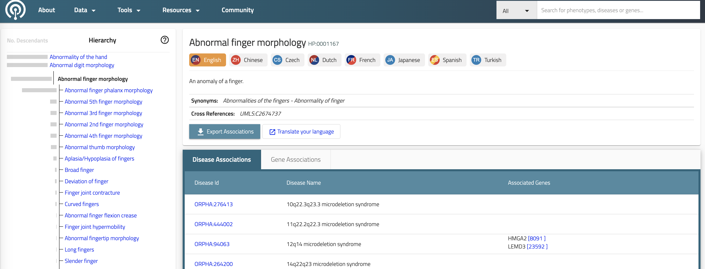

# Documentation for Human Phenotype Ontology (HPO)

This site contains documentation for clinician, researchers, developers, and other users of the [HPO](https://hpo.jax.org/app/).

<figure markdown>
{ width="600" }
<figcaption><b>The HPO</b>.
Human Phenotype Ontology (HPO) is an ontology developed by the Monarch Initiative used to describe human phenotypic abnormalities seen in genetic disorders and clinical research.
It provides a structured representation of abnormal characteristics associated with diseases.
HPO helps researchers and clinicians share and integrate phenotypic data, making understanding and diagnosing genetic disorders easier.
It uses a hierarchical organization and semantic relationships between terms and allows for annotation of genes and diseases. HPO is used in multiple diagnosis and variant prioritization tools, aiding healthcare professionals and researchers in identifying and classifying genetic conditions.
In 2023, HPO has released an international edition which covers different languages such as Chinese, Turkish, Japanese, Spanish and Czech (https://obophenotype.github.io/hpo-translations/).
The translations are displayed in the HPO browser (e.g. https://hpo.jax.org/app/browse/term/HP:0001166) and OLS (https://www.ebi.ac.uk/ols4/ontologies/hp).
</figcaption>
</figure>
